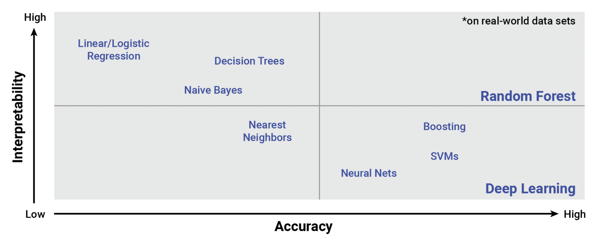

# Capstone_Project
Final Project for Data Analytics Class: Using Common Financial Indicators to Predict Stock Performance

[Link to Google Slides](https://docs.google.com/presentation/d/1rg12WplVf4fy3VU82EIZb64H5yveYUukMScgsefe0KI)

## Overview

The allure of better understanding the relationship between a company’s financial data and it's stock performance is obvious. The market seems chaotic and random, but with enough data can we reasonably predict a company's stock performance? Can we determine which metrics are significantly tied to a stock's movement? We attempt to answer these questions by making some simplifying assumptions and using the tools we learned from this course.

**Questions this analysis attempts to answer:** 
1) How well can publicly disclosed financial data predict the performance of a stock, measured by whether the stock price increased or decreased in the following calendar year?
2) Which financial indicators have the most predictive power?

## Technologies and Tools

The following technologies and languages were used for the analysis
- Excel
- Jupyter Notebook
- Python, including the following libraries:
  - Pandas
  - Matplotlib
  - SQLAlchemy
  - Scikit-learn
  - Imbalance-learn
  - TensorFlow
- SQLite
- Tableau
- Google Slides
- Github

## Data

### Source and Description

The data was sourced from [Kaggle's data repository](https://www.kaggle.com/datasets/cnic92/200-financial-indicators-of-us-stocks-20142018). The full data set consists of four csv files containing over 200 key financial indicators typically found in annual 10-k fillings from roughly 4000 companies for the years 2014 - 2018. In addition to the financial indicators, the data contained price variance field, defined as the percentage change in the stock's price over the calendar year), and a class variable with the label "1" if the price increased and "0" otherwise. For this analysis we focused only on the 2018 data set. 

### Exploration

During the initial data exploration, we made a few observations:
- The data contained null values
- The data contained suspicious values (for example, values falling outside of expected ranges)
- Some variables had outliers
- There were redundant variables (multiple columns of the same variable)
- Many variables had some overlapping (for example, gross profit and net profit)
- The two classes in the target variable "Class" are imbalanced, with 70% of stocks falling into class 1

To make data processing and model training more efficient, we decided to select and keep only a subset of the variables that are commonly considered to be most indicative of company performance. The following variables were kept in the data:

1. Gross Profit Margin = (Revenue - Cost of Sales) / Revenue * 100
2. Net Profit Margin = Net Profit / Revenue * 100
3. Working Capital = Current Assets - Current Liabilities
4. Current Ratio = Current Assets / Current Liabilities
5. Quick Ratio = (Current Assets - Inventory) / Current Liabilities
6. Leverage = Total Assets / Total Equity
7. Debt to Equity Ratio = Total Debt / Total Equity
8. Inventory Turnover = Cost of Sales / (Beginning Inventory + Ending Inventory / 2)
9. Total Asset Turnover = Revenue / (Beginning Total Assets + Ending Total Assets / 2)
10. Return on Equity (ROE) = Net Profit / (Beginning Equity + Ending Equity) / 2
11. Return on Assets (ROA) = Net Profit / (Beginning Total Assets + Ending Total Assets) / 2
12. Operating cash flow
13. Earnings per Share (EPS)
14. Price-Earnings Ratio (P/E)
15. EBITDA
16. Free cash flow
17. Sector
18. R&D expense
19. Class (1 = price increased, 0 = price decreased or constant)

In our machine learning algorithm, variables 1-18 are independent variables (features) that will be used to predict the dependent variable (target) "Class".

## Analysis

### Preprocessing

To prepare the data for machine learning, we imported the csv data file into Jupyter Notebook and created a Pandas dataframe. Only the variables identified in the exploration process were kept, and the rest were dropped. 

Next we checked for null values in each variable. Two variables - ROA and Working Capital, had a significant number of null values and were dropped from the data. After removing those columns, all rows with one or more null values were dropped. 

Only the Sector variable had categorical data which required encoding, the rest of the columns were in numerical format. 

After encoding Sector, the data was split into X train, y train, X test and y test data sets. As the range of variables varied widely - some were ratios and other were in dollar amounts, the features were scaled to normalize the data. 

To store the data in a relational database, we used Sqlalchemy to create a sqlite database consisting of two tables - Features and Target, that hold the processed data. Queries and joins were performed to ensure that the tables were created properly.

[stock_prediction_seg2_v6.ipynb](https://github.com/kristindong/Capstone_Project/blob/main/stock_prediction_seg2_v6.ipynb)

### Machine Learning

The question we're trying to answer - how well can a chosen set of financial metrics predict whether the stock price increased or decreased, is a classification problem. We start with a logistic regression model, because it is simple and has high interpretability compared to other more complex algorithms. 

#### Logistic Regression

The logistic regression model overall accuracy score is 0.69. This is not a great score since 67% (661 / 980) accuracy can be achieved by simply predicting all 1s without using any model at all. Furthermore, because the data is imbalanced, the model it did not perform very well in either precision or recall for class 0. This was anticipated during our data exploration phase.

#### Other Models
We tested a few other algorithms. The results are summarized below.

#### Conclusion

- None of the models were great but Random Forest and Easy Ensemble had slightly better results

- Model choice should depend on how it will be used

- Precision is more important than recall if model is used to make investment decisions, since false positives would result in financial loss

- If strategy is buy class 1, don’t act on class 0, then maximize class 1 precision

- If strategy is buy class 1 and short class 0, then maximize both precisions

- Model ignore other significant factors such as overall economy, investor sentiment, world events

## Visualizations

We utilized Tableau to create visualizations to make our analysis and results more engaging and accessible.

[Link to tableau story](https://public.tableau.com/app/profile/samim.arif4259/viz/Finalprojectpresentation/FinalProjectPresentation?publish=yes)
